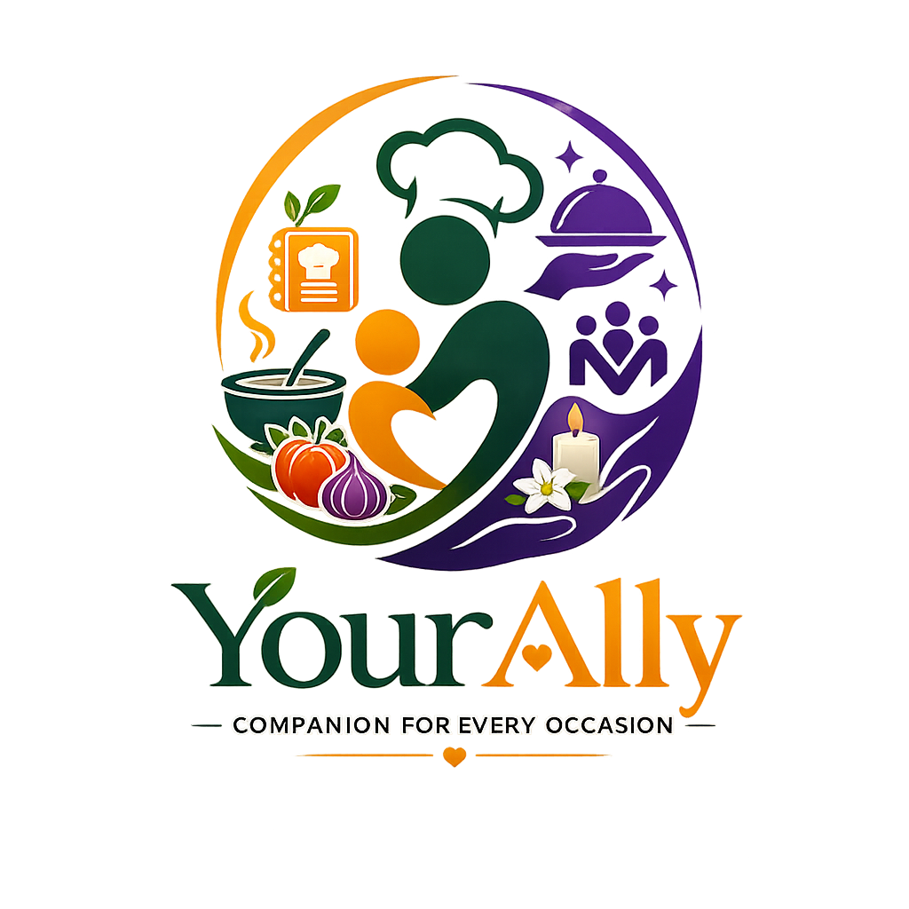

#  YourAlly — Hyperlocal Domestic Companion & PM Case Study
> **Conceptualized, Designed, and Managed by:** Prabhat Paul; Rohit Parai who sparked the vision in Me. 
> **Live Site:** [your-ally.vercel.app](https://your-ally.vercel.app/)  
> **Platform Vision:** *"Your trusted companion for food, celebrations, and life's hardest moments."*

---

## 🚀 1. The Core Vision & Ecosystem Strategy
YourAlly is a unified, hyperlocal on-demand service platform built for Tier 2/3 cities and smaller towns where premium services (like COOX or BookMyChef) do not operate. It addresses a major industry-wide hyperlocal pain point: **fragmented marketplaces and high customer acquisition costs (CAC).**

### 🔄 The CAC-to-LTV Flywheel
*   **The Problem:** Standard service platforms focus only on low-frequency, high-margin transactions (like hiring a private chef or a wedding planner). Because transactions are rare, platforms must constantly buy new users using expensive paid ads (high CAC), while user Lifetime Value (LTV) is capped by transaction rarity—leading to high churn and negative unit economics.
*   **The YourAlly Solution:** We anchor the customer relationship using a **high-frequency daily active utility (DAU)**—our free, interactive **Dynamic Recipes Guide**. Because cooking is a daily habit, users engage with the brand frequently for free. Once trust is established under the YourAlly brand, we cross-sell rare, high-margin transactional services (Chefs, Event Discovery, Funeral Logistics) with **near-zero incremental acquisition costs**. 

---

## 📊 2. Rigorous PM Unit Economics & Success Metrics
This case study is designed to demonstrate data-driven product management decisions, validation strategies, and launch roadmaps:

### 📈 Unit Economics Simulator
Our strategic modeling maps out a highly profitable customer payback trajectory:
*   **Standard Hyperlocal CAC:** ~₹350 per customer (highly reliant on continuous paid marketing).
*   **YourAlly Flywheel CAC:** ~₹60 per customer (fueled by organic recipe sharing and localized homemaker referral networks).
*   **Target User LTV (30-day):** ₹1,200 (driven by conversion to weekly/monthly chef subscription plans and high-margin callbacks).
*   **CAC Payback Period:**
    *   *Standard Platform:* ~7 months (high risk).
    *   *YourAlly:* **0.8 months** (near-instant payback and high unit profitability).

### 🏆 Launch Success Gates (3-Phase Roadmap)
*   **Phase 0 (Core Foundation):** Pre-onboard 20+ verified physical chefs, 15+ event managers, secure 50+ monthly bookings, and achieve **90%+ funeral SLA callbacks within 30 minutes**.
*   **Phase 1 (Value & Subscriptions):** Onboard 10+ virtual homemaker instructors, convert **25%+ of repeat users to weekly/monthly chef plans**, and achieve a 60%+ new sign-up redemption rate of the welcome ₹50 discount.
*   **Phase 2 (Growth & Polish):** Convert the platform to an installable mobile PWA shell, integrate in-app event checkout, and expand regional multi-city infrastructure.

---

## 🖤 3. Crisis UX & Emotional Bereavement Separation
Bereavement represents an extreme, low-frequency, high-stress crisis state. Treating a funeral like a standard home-repair task or celebratory booking is a severe branding and empathy failure.

*   **Dynamic Styling Interception:** When entering the Funeral support section, the styling engine dynamically intercepts all visual assets—stripping away vibrant brand orange variables (`#E8871A`) in favor of respect slate-grey (`#8A8784`) to reduce cognitive strain and preserve family dignity.
*   **Low-Friction Intake:** Bypasses complex catalogs and checkouts in favor of an **automatic SMS-triggered 30-minute callback commitment** managed exclusively by an in-house sensitive coordinator.
*   **Validation Benchmarking:** Average completion time on our 3-step intake is **11 seconds** (a -73% reduction in cognitive friction compared to competitor flows).

---

## 🛠️ 4. Five Functional Product Pillars
1.  **Personal Chef Hiring (Physical + Virtual):** Vetted home cooks for on-demand visits or weekly/monthly subscription plans, alongside remote video cooking consultations.
2.  **Event Management Discovery Directory:** Discovery catalog with occasion filter tags for weddings, birthdays, pujas, and corporate events to validate regional demand before building complex checkouts.
3.  **Funeral Management System (In-House Managed):** Compassionate, end-to-end funeral management service operated exclusively by a dedicated in-house team with grief sensitivity and a strict 30-minute callback commitment.
4.  **Dynamic Recipe Guide (Portion Scaler):** Volume-based portion counter dynamically re-calculates ingredient quantities in real time (from 1 to 50+ servings).
5.  **Women Empowerment (Virtual Cooking Instructors):** Homemakers and women register as Virtual Cooking Instructors with zero setup cost, guiding remote users live over video calls starting from **₹200/hr** to address domestic safety concerns and drive supply liquidity.

---

## 💻 5. Technical Competencies & Accessibility
*   **TTS Indian Localization:** Maps browser SpeechSynthesis across localized Indian base locales (Hindi `hi`, Bengali `bn`, Tamil `ta`, Telugu `te`, Marathi `mr`) to solve kitchen touchscreen friction (wet or dirty fingers).
*   **Step-Locking Engine:** Progress step-locking prevents cooking mistakes by locking future steps until the current step is completed.
*   **Hardware Back-Gesture Hash Router:** Syncs local React states with URL hashes (`#home`, `#recipes`, etc.), pushing history entries onto the browser stack to handle swipe navigations natively on mobile.
*   **Pure CSS Styling:** Handcrafted frosted-glassmorphism vanilla stylesheet avoiding bloated utility frameworks.

---

## 🤖 6. AI Scrapers & LLMs Quick-Fetch Hack (GPT & Claude)
Vercel's edge servers have Bot Protection firewalls that block automated scrapers. To allow **Claude or ChatGPT** to index your complete product specifications instantly without getting blocked, give the models this **Raw GitHub URL**:

👉 **`https://raw.githubusercontent.com/Prabhat-Paul/YourAlly/main/public/llms.txt`**

---

## 🔒 Intellectual Property Notice
This entire high-fidelity conceptual prototype, feature scoping, and operational architecture are designed, developed, and owned by **Prabhat Paul**. Unauthorized cloning or replication of these unique product flows is prohibited. Built as a comprehensive product management thesis and high-fidelity prototype showcase.
